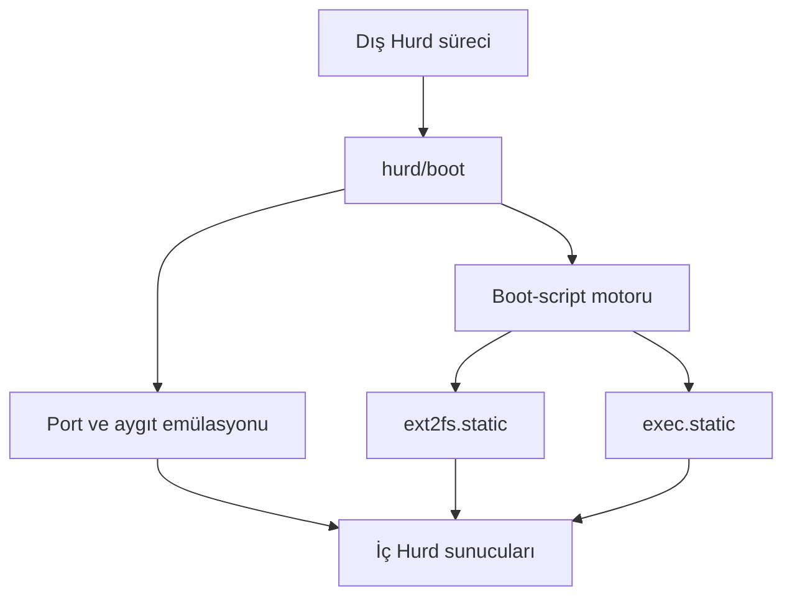
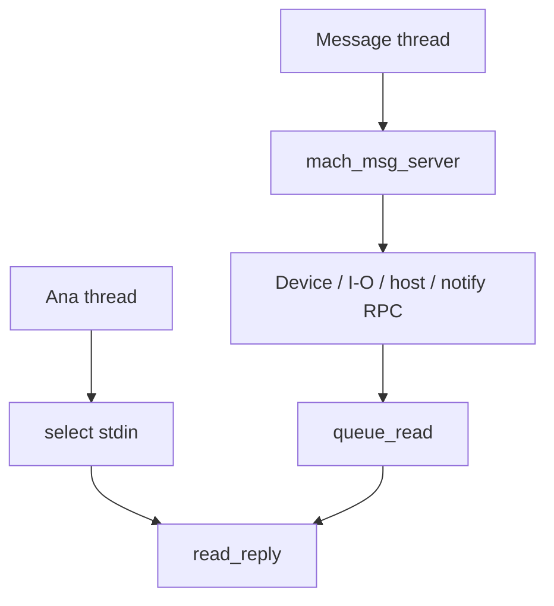
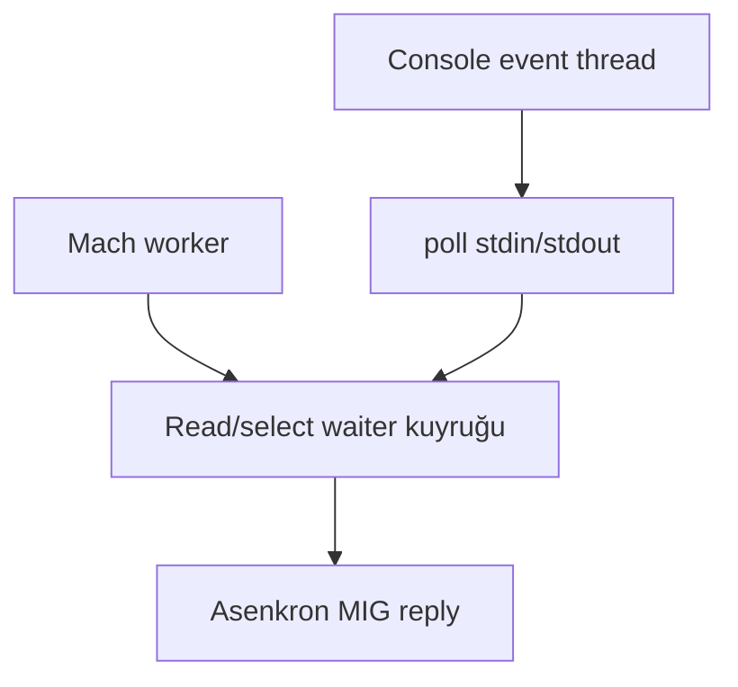

# GNU/Hurd `hurd/boot/boot.c` Ayrıntılı Teknik İnceleme

> İnceleme türü: mimari çözümleme, doğruluk, eşzamanlılık, Mach IPC/capability güvenliği,
> bellek yönetimi, hata yolları, 64-bit taşınabilirlik ve test edilebilirlik
>
> İncelenen kaynak: kullanıcı tarafından gönderilen `hurd/boot/boot.c`
>
> Kaynak sürüm göstergesi: telif başlığı 1993–2016 aralığını gösteriyor. Bu rapor,
> gönderilen dosyanın kendisini inceler; güncel upstream GNU/Hurd ağacıyla sürüm farkı
> karşılaştırması yapmaz.

---

## İçindekiler

1. [Yönetici özeti](#1-yönetici-özeti)
2. [İncelemenin kapsamı ve kesinlik seviyeleri](#2-incelemenin-kapsamı-ve-kesinlik-seviyeleri)
3. [Programın gerçekte yaptığı iş](#3-programın-gerçekte-yaptığı-iş)
4. [Güvenlik modeli: privileged ve unprivileged Subhurd](#4-güvenlik-modeli-privileged-ve-unprivileged-subhurd)
5. [Başlatma ve çalışma akışı](#5-başlatma-ve-çalışma-akışı)
6. [Mach port topolojisi](#6-mach-port-topolojisi)
7. [Boot-script düzeni](#7-boot-script-düzeni)
8. [Eşzamanlılık modeli](#8-eşzamanlılık-modeli)
9. [Toplu bulgu tablosu](#9-toplu-bulgu-tablosu)
10. [Kritik bulgular](#10-kritik-bulgular)
11. [Yüksek önem dereceli bulgular](#11-yüksek-önem-dereceli-bulgular)
12. [Orta önem dereceli bulgular](#12-orta-önem-dereceli-bulgular)
13. [Düşük önem dereceli ve bakım bulguları](#13-düşük-önem-dereceli-ve-bakım-bulguları)
14. [Fonksiyon bazında inceleme](#14-fonksiyon-bazında-inceleme)
15. [64-bit ve NeOx64 açısından değerlendirme](#15-64-bit-ve-neox64-açısından-değerlendirme)
16. [Önerilen düzeltme mimarisi](#16-önerilen-düzeltme-mimarisi)
17. [Regresyon ve saldırgan test matrisi](#17-regresyon-ve-saldırgan-test-matrisi)
18. [Önerilen düzeltme sırası](#18-önerilen-düzeltme-sırası)
19. [Olumlu tasarım özellikleri](#19-olumlu-tasarım-özellikleri)
20. [Sonuç](#20-sonuç)

---

## 1. Yönetici özeti

`hurd/boot/boot.c`, adının çağrıştırdığı gibi yalnızca bir betik okuyucusu değildir.
Dış Hurd ortamında çalışan ve içte ikinci bir Hurd sistemi —bir Subhurd— başlatmak için
kısmi çekirdek/aygıt davranışını kullanıcı uzayında taklit eden bir bootstrap sunucusudur.

Program şu temel işleri bir araya getirir:

- Kök depolama nesnesini iç Hurd'a blok aygıtı gibi sunar.
- Dış sürecin stdin/stdout uçlarını iç Hurd konsoluna bağlar.
- `/dev/time` için memory-object eşlemesi sağlar.
- Unprivileged modda sahte privileged-host, processor-set ve kernel-task nesneleri üretir.
- Yeni ve ölen task'ları Mach notification mesajlarıyla takip eder.
- Birden fazla MIG arayüzini tek bir Mach port-set üzerinden sunar.
- Boot-script motoruyla `ext2fs.static` ve `exec.static` görevlerini oluşturur.

Temel fikir güçlüdür; fakat incelenen sürüm modern anlamda sağlamlaştırılmış bir güvenlik
sınırı değildir. En önemli sonuçlar şunlardır:

1. **Konsol read kuyruğunun tail işaretçisi güncellenmemektedir.** Birden fazla bekleyen
   okuma isteğinde kuyruk bozulur; istekler kaybolabilir ve istemciler sonsuza kadar
   bekleyebilir.
2. **`S_host_reboot` hedef portu doğrulamamaktadır.** Ortak port-set tasarımı nedeniyle,
   başka bir pseudo porta send right sahibi istemci uygun Mach RPC kimliğiyle boot
   sunucusunu kapatabilir.
3. **`S_processor_set_tasks` hedef processor-set portunu doğrulamamaktadır.** Bu durum
   task portlarının yanlış capability üzerinden açığa çıkmasına yol açabilir.
4. **In-band read boyları sınırlandırılmamaktadır.** MIG stub tarafından ayrıca güvence
   sağlanmıyorsa sabit in-band tampon üzerinde taşma mümkündür.
5. **Bloklayan `io_select` tek Mach mesaj thread'ini durdurabilir.** Bir konsol seçme
   isteği bütün pseudo-kernel hizmetini bloke edebilir.
6. **`should_read` üzerinde kilitsiz, atomik olmayan iki-thread erişimi vardır.** C bellek
   modeline göre bu bir data race ve tanımsız davranıştır.
7. **EOF, geçici veri yokluğu ve kuyruk yokluğu doğru ayrılmamaktadır.** Sonuç CPU busy-loop,
   cevapsız read veya kapanmayan Subhurd olabilir.
8. **`ds_device_map`, `io_map` başarısız olsa bile başarı döndürmektedir.** İstemciye
   geçersiz/başlatılmamış pager verilebilir.
9. **`S_io_reauthenticate` tasarım gereği çalışamaz durumdadır.** `authserver` null kalır,
   hata yine de başarı olarak döndürülür ve cleanup kısmında `au` iki kez, `ag` hiç
   deallocate edilmez.
10. **Task listesinin kapasitesi kanıtlanmamış bir invariant'a dayanır.** `pseudo_kernel`
    hash içinde değilse OOL task dizisine bir eleman fazla yazılabilir.

Bu bulguların bir bölümü normal, iyi niyetli boot akışında nadiren görünür. Ancak dosyanın
kendi açıklamasına göre unprivileged Subhurd'ın amacı güvenlik etkisini sınırlandırmaktır.
Bu nedenle iç Hurd'dan gelebilecek bozuk veya kasıtlı Mach mesajları güvenilir kabul
edilmemelidir.

---

## 2. İncelemenin kapsamı ve kesinlik seviyeleri

### 2.1 İncelenen malzeme

Bu rapor yalnızca gönderilen `boot.c` içeriğine dayanır. Aşağıdaki tamamlayıcı dosyalar
verilmediği için bazı ABI ve right-sahipliği ayrıntıları ayrıca doğrulanmalıdır:

- `device.defs`, `io.defs`, `mach.defs`, `mach_host.defs`, `gnumach.defs`
- Bunlardan üretilen `*_S.h` ve `*_U.h` MIG stub'larının gerçek gövdeleri
- `boot_script.c` ve `boot_script.h`
- `private.h` içindeki ortak global ve callback sözleşmeleri
- Kullanılan GNU Mach ve glibc sürümünün tip tanımları

### 2.2 Kesinlik sınıfları

Raporda bulgular şu sınıflardan biriyle etiketlenir:

- **Kesin:** Kusur doğrudan bu dosyadaki kontrol akışından kanıtlanabiliyor.
- **Yüksek olasılık:** Normal GNU Mach/MIG sözleşmeleri altında kusur oluşuyor; nihai ABI
  ayrıntısı üretilmiş stub ile teyit edilmeli.
- **Koşullu:** Belirli bir `.defs`, tip genişliği, pager veya right-disposition davranışına
  bağlı.
- **Bakım:** Doğrudan güvenlik açığı değildir; teşhis, taşınabilirlik veya sürdürülebilirlik
  sorunudur.

### 2.3 Satır numaraları

Kullanıcının gönderdiği dosya bir Markdown code fence içinde başladığından bu rapordaki
satır numaraları ek dosyadaki numaralardır. Gerçek C kaynağında yaklaşık bir satır geriye
kayabilir. Örneğin rapordaki 846. satır, çıplak `boot.c` içinde yaklaşık 845. satırdır.

---

## 3. Programın gerçekte yaptığı iş

Programın üst seviye mimarisi şöyledir:



### 3.1 `boot` neden kernel gibi davranır?

İç Hurd'ın başlangıç sunucuları normalde çekirdekten veya bootstrap ortamından şu tür
capability'ler bekler:

- Privileged host portu
- Device master portu
- Kernel task portu
- Root block device
- Konsol device/I/O portu
- Processor-set portu ve task listesi
- Task yaratılma/ölüm bildirimleri

Gerçek GNU Mach çekirdeğinin privileged portlarını iç sisteme vermek güvenli değildir.
Bu nedenle unprivileged mod, bu capability'lerin sınırlı taklitlerini üretir. İç sistem
onları gerçek çekirdek portlarıymış gibi kullanır; fakat istekleri aslında `boot.c`
karşılar.

### 3.2 Device katmanı

`ds_device_open`, üç dahili aygıt adı tanır:

- `console` → `pseudo_console`
- `time` → `pseudo_time`
- `pseudo-root` → `pseudo_root`

Ek olarak `-f SUBHURD_NAME=DEVICE_FILE` ile dış filesystem üzerindeki bir node iç Hurd'a
aygıt adıyla geçirilebilir. Privileged modda eşleşmeyen aygıtlar gerçek
`master_device_port` üzerinden açılabilir; unprivileged modda reddedilir.

### 3.3 Root store katmanı

Root store belirli koşullarda gerçek device olarak doğrudan geçirilebilir:

- Store sınıfı `store_device_class` olmalı.
- Adı bulunmalı.
- `STORE_ENFORCED` bayrağı bulunmalı.
- Tek bir run olmalı.
- Run sıfırdan başlamalı.
- Süreç privileged olmalı.

Bu şartlar sağlanmazsa iç filesystem, `pseudo-root` aygıtına read/write istekleri gönderir;
`boot.c` bunları `store_read` ve `store_write` çağrılarına dönüştürür.

### 3.4 Konsol katmanı

`pseudo_console`, aynı receive right üzerinde birden fazla arayüz sunar:

- Mach device arayüzü (`ds_device_read`, `ds_device_write`, ...)
- Hurd I/O arayüzü (`S_io_read`, `S_io_write`, `S_io_select`, ...)
- Terminal arayüzünün küçük bir bölümü (`S_term_getctty`)

Bu çoklu arayüz yaklaşımı pratik olmakla birlikte her RPC handler'ın hedef portu kontrol
etmesini zorunlu kılar. Aksi halde bir arayüz için verilmiş send right, başka arayüzün
RPC'sini çağırmak için kullanılabilir.

---

## 4. Güvenlik modeli: privileged ve unprivileged Subhurd

### 4.1 Privileged mod

`--privileged` istendiğinde program:

```c
get_privileged_ports (&privileged_host_port, &master_device_port)
```

ile dış sistemin privileged portlarını almaya çalışır. Başarılı olursa:

- Boot-script'e gerçek `privileged_host_port` verilir.
- Bilinmeyen device adları gerçek `master_device_port` üzerinden açılabilir.
- Uygun root device store doğrudan geçirilebilir.
- Bootstrap argümanlarına `f` eklenir.

Bu modun güvenlik sonucu açıktır: iç Subhurd, dış sistem üzerinde güçlü kernel capability'leri
elde eder. Kodun üst açıklaması da privileged Subhurd'ın bütün task'ları manipüle edebildiğini
ve sistemi durdurabildiğini belirtir.

### 4.2 Unprivileged mod

Varsayılan güvenli modda program:

1. `pseudo_privileged_host_port` oluşturur.
2. `pseudo_pset` oluşturur.
3. Task notification portlarını oluşturur.
4. `proc_make_task_namespace` ile yeni task namespace ister.
5. Boş bir `pseudo_kernel` task'ı oluşturur.
6. Gerçek master-device portuna bilinmeyen aygıt geçişini kapatır.

Amaç, iç Hurd'ın normal boot beklentilerini karşılamak ve ona yalnızca kontrollü bir
çekirdek görünümü vermektir.

### 4.3 Tehdit modeli

Unprivileged mod gerçek bir güvenlik sınırı sayılacaksa şu aktör güvenilmez kabul edilmelidir:

> İç Hurd'da çalışan, kendisine verilmiş en az bir Mach send right'ı bulunan ve keyfi Mach
> mesajı oluşturabilen bir task.

Bu aktör yalnızca normal libc stub'larını çağırmak zorunda değildir. Mesaj kimliğini,
scalar alanları, port disposition'larını ve istek sırasını elle oluşturabilir. Bu nedenle
“normal istemci bu değeri göndermez” savunması güvenlik incelemesi açısından yeterli değildir.

---

## 5. Başlatma ve çalışma akışı

### 5.1 Komut satırının ayrıştırılması

Desteklenen önemli seçenekler:

| Seçenek | Amaç |
|---|---|
| `--boot-script` | Özel boot-script dosyası |
| `--boot-root`, `-D` | Script içindeki dosyalar için dış kök dizini |
| `--single-user`, `-s` | Bootstrap argümanlarına `s` ekler |
| `--kernel-command-line`, `-c` | Taklit edilen multiboot komut satırı |
| `--verbose`, `-v` | Ayrıntılı log |
| `--pause`, `-d` | Boot öncesi kullanıcı onayı |
| `--isig`, `-I` | Raw terminalde sinyalleri yeniden etkinleştirir |
| `--device`, `-f` | İç aygıt adını dış dosyaya eşler |
| `--privileged` | Gerçek privileged kernel portlarını geçirir |

Store seçenekleri `store_argp` child parser'ına bırakılır.

### 5.2 Root store'un açılması

`store_parsed_name` tanısal ad üretir, `store_parsed_open` ise gerçek `struct store`
nesnesini açar. Hata halinde `error()` doğrudan süreci sonlandırır.

### 5.3 Port-set kurulumu

Program `receive_set` adlı `MACH_PORT_RIGHT_PORT_SET` oluşturur ve sözde receive portlarını
bu sete taşır. Daha sonra tek message thread bu port-set üzerinden bütün istekleri alır.

### 5.4 Boot değişkenleri

Aşağıdaki değişkenler script motoruna verilir:

| Değişken | Değer |
|---|---|
| `${host-port}` | Gerçek veya sahte privileged-host portu |
| `${device-port}` | `pseudo_master_device_port` |
| `${kernel-task}` | Unprivileged modda `pseudo_kernel` |
| `${kernel-command-line}` | Taklit edilen kernel komut satırı |
| `${root-device}` | Gerçek device adı veya `pseudo-root` |
| `${boot-args}` | `-`, `s`, `d`, `f` birleşimi |

Kernel komut satırındaki her `FOO=BAR` kelimesi ayrıca `${FOO}` adlı string değişkene
dönüştürülür.

### 5.5 Script ayrıştırma ve yürütme

Harici script varsa tüm dosya belleğe alınır; yoksa `default_boot_script` kopyalanır.
Yeni satırlar yerinde NUL karakterine dönüştürülür ve her satır
`boot_script_parse_line` ile ayrıştırılır. Daha sonra terminal raw moda alınır ve
`boot_script_exec()` çağrılır.

### 5.6 Sürekli çalışma

Boot tamamlandıktan sonra iki thread vardır:

- **Ana thread:** fd 0 üzerinde `select()`, ardından `read_reply()`.
- **Message thread:** `mach_msg_server(boot_demuxer, ..., receive_set)`.

Bu ayrımın amacı Mach mesaj thread'ini host terminalinin input beklemesinden korumaktır;
fakat `S_io_select` ve mevcut read kuyruğu bu ayrımı kısmen bozmaktadır.

---

## 6. Mach port topolojisi

| Port | Oluşturulduğu mod | Set üyeliği | Send right üretimi | Beklenen protokol |
|---|---:|---:|---|---|
| `pseudo_master_device_port` | Her zaman | Evet | Başlangıçta bir send right + open talepleri | Device master |
| `pseudo_console` | Her zaman | Evet | `MACH_MSG_TYPE_MAKE_SEND` | Device, I/O, term |
| `pseudo_time` | Her zaman | Evet | `MACH_MSG_TYPE_MAKE_SEND` | Device map |
| `pseudo_root` | Gerektiğinde | Evet | `MACH_MSG_TYPE_MAKE_SEND` | Device read/write/status |
| `pseudo_privileged_host_port` | Unprivileged | Evet | Başlangıçta bir send right | Mach host emülasyonu |
| `pseudo_pset` | Unprivileged | Evet | Başlangıçta bir send right | Processor-set emülasyonu |
| `task_notification_port` | Unprivileged | Evet | Proc'a `MAKE_SEND` | Yeni task bildirimleri |
| `dead_task_notification_port` | Unprivileged | Evet | Notification isteğinde kullanılır | Dead-name bildirimleri |

### 6.1 Demux sırası

`boot_demuxer` sırayla şu generated routine seçicilerini dener:

1. `io_server_routine`
2. `device_server_routine`
3. `notify_server_routine`
4. `term_server_routine`
5. `mach_server_routine`
6. `mach_host_server_routine`
7. `gnumach_server_routine`
8. `task_notify_server_routine`

Seçim temelde `msgh_id` üzerinden yapılır. Hedef portun doğru nesne sınıfına ait olduğu
demux katmanında merkezi olarak doğrulanmaz. Dolayısıyla bu doğrulama her uygulama
fonksiyonunun sorumluluğundadır.

### 6.2 Process subsystem mesajlarının forward edilmesi

`task_notification_port` üzerine gelen 24000–24099 aralığındaki mesajlar, iç proc sunucusu
bir notification portu kaydetmişse `mach_msg_forward` ile ona yönlendirilir. Fonksiyon:

- Eski reply portunu yeniden local konuma koyar.
- Yeni destination'ı remote port yapar.
- Remote disposition'ı yeni destination için ayarlar.
- Kompleks mesajlardaki OOL bellek ve port right taşıma semantiğine güvenir.

Bu yaklaşım kavramsal olarak doğru görünür. Bununla birlikte `mach_msg` gönderimi başarısız
olduğunda kompleks mesaj kaynaklarının kim tarafından yok edileceği generated server ve
`mach_msg_server` davranışıyla birlikte denetlenmelidir.

---

## 7. Boot-script düzeni

Varsayılan script iki program tanımlar.

### 7.1 Bootstrap filesystem

İlk program `/hurd/ext2fs.static`'tir. Şu bilgileri alır:

- Read-only çalışma talebi
- Multiboot/kernel komut satırı
- Host privileged portu
- Device master portu
- Kernel task portu
- Exec server task portu
- Root device adı

`$(task-create)` ile task yaratılır ve `$(task-resume)` ile çalıştırılır.

### 7.2 Exec server

İkinci program `/hurd/exec.static`'tir:

```text
/hurd/exec.static $(exec-task=task-create)
```

Task yaratılır ve portu `${exec-task}` değişkenine kaydedilir; doğrudan resume edilmez.
Filesystem sunucusunun hazır olduktan sonra exec task'ını devam ettirmesi beklenir.

### 7.3 Yorum-kod uyuşmazlığı

Kaynak yorumu dinamik `exec` için boot loader'ın `ld.so` çalıştırdığını anlatır; fakat mevcut
komut doğrudan `exec.static` kullanmaktadır. Bu çalışma zamanı hatası değildir, ancak kodun
tarihsel değişiklikten sonra yorumunun güncellenmediğini gösterir.

---

## 8. Eşzamanlılık modeli

### 8.1 Thread görevleri



### 8.2 Paylaşılan durum

| Durum | Koruma | Sorun |
|---|---|---|
| `qrhead`, `qrtail` | `queuelock` | Tail güncelleme mantığı bozuk |
| stdin read işlemi | `readlock` | Kilit syscall boyunca tutuluyor |
| `should_read` | Etkin koruma yok | C data race |
| `task_ihash` | Ayrı kilit yok | Şu an tek message thread varsayımına bağlı |
| `console_mscount` | Ayrı kilit yok | Şu an message thread serileştirmesine bağlı |
| `new_task_notification` | Ayrı kilit yok | Şu an message thread serileştirmesine bağlı |

`task_ihash` gibi yapıların kilitsizliği bugünkü tek message thread düzeninde kabul edilebilir.
Ancak `io_select` sorununu çözmek için birden fazla worker eklenirse bu yapılar da ayrıca
kilitlenmek zorunda kalacaktır.

---

## 9. Toplu bulgu tablosu

| Kimlik | Önem | Kesinlik | Kısa açıklama |
|---|---|---|---|
| BOOT-QUEUE-001 | Kritik | Kesin | `queue_read` non-empty eklemede `qrtail` ilerletmiyor |
| CAP-001 | Kritik | Kesin | `S_host_reboot` hedef host portunu doğrulamıyor |
| CAP-002 | Kritik | Kesin | `S_processor_set_tasks` hedef pset portunu doğrulamıyor |
| MEM-001 | Kritik | Yüksek olasılık | In-band read boyu sabit tampon kapasitesiyle sınırlandırılmıyor |
| CONC-001 | Yüksek | Kesin | `should_read` üzerinde data race |
| LIVE-001 | Yüksek | Kesin | `S_io_select` tek message thread'i bloke ediyor |
| IO-001 | Yüksek | Kesin | EOF doğru işlenmiyor; read cevapsız ve ana döngü busy-loop olabilir |
| IO-002 | Yüksek | Kesin | Veri var fakat kuyruk yokken CPU busy-loop oluşabilir |
| DEV-001 | Yüksek | Kesin | `ds_device_map`, `io_map` hatasını başarıya çeviriyor |
| AUTH-001 | Yüksek | Kesin | `authserver` null; reauthentication işlevsiz |
| AUTH-002 | Yüksek | Kesin | Reauthentication hatası başarı olarak dönüyor |
| AUTH-003 | Yüksek | Kesin | `au` iki kez, `ag` hiç deallocate edilmiyor |
| TASK-001 | Yüksek | Yüksek olasılık | Task array kapasitesi `pseudo_kernel` invariant'ına bağlı |
| MEM-002 | Yüksek | Kesin/koşullu | İstemci kontrollü uzunlukla `alloca`; tür daralması ve stack overflow |
| MEM-003 | Orta/Yüksek | Koşullu | OOL kısa read veya send failure sonrası mapping sızıntısı |
| IO-003 | Orta | Kesin | Sıfır uzunluklu queued `DEV_READ`, `mmap(0)` assertion'ına gidebilir |
| IO-004 | Orta | Kesin | `FIONREAD` dönüşleri yok sayılıyor |
| IO-005 | Orta | Kesin | `SELECT_WRITE`, stdout yerine stdin'i izliyor |
| TASK-002 | Orta | Kesin | `mach_port_mod_refs` dönüşü kontrol edilmiyor |
| TASK-003 | Orta | Yüksek olasılık | New-task hata yolunda port right cleanup eksik |
| INIT-001 | Orta | Kesin | Mach port kurulum çağrılarının çoğu kontrol edilmiyor |
| INIT-002 | Orta | Kesin | `allocate_pseudo_ports` daima başarı döndürüyor |
| THREAD-001 | Orta | Kesin | Message thread yaratılamazsa süreç yarı-canlı devam ediyor |
| SCRIPT-001 | Orta | Kesin | Script `read()` hatası EOF gibi kabul ediliyor |
| SCRIPT-002 | Orta | Kesin | `strdup` ve device-map allocation sonuçları eksik kontrol ediliyor |
| SCRIPT-003 | Düşük/Orta | Kesin | Script buffer 500 byte doğrusal adımlarla büyüyor |
| SCRIPT-004 | Düşük/Orta | Koşullu | Kernel command line `alloca` ile stack'e kopyalanıyor |
| SCRIPT-005 | Düşük | Tasarım | `FOO=BAR` parser quoting/escaping desteklemiyor |
| TTY-001 | Orta | Kesin | Terminal initialize edilmeden restore denenebilir |
| TTY-002 | Orta | Kesin | Sinyal/abort yolları terminali raw bırakabilir |
| DEV-002 | Orta | Kesin | `pseudo_time`, `ds_device_close` tarafından tanınmıyor |
| STATUS-001 | Orta | Koşullu | Store boyutları device-status alanlarında daralabilir |
| NOTIFY-001 | Düşük | Kesin | İşlenen no-senders olayları çoğu kez `EOPNOTSUPP` döndürüyor |
| ERROR-001 | Düşük/Orta | Kesin | Ortam hatalarında assertion kullanımı hizmeti gereksiz düşürebilir |
| ERROR-002 | Düşük | Kesin | Bazı ayrıntılı store/device hataları `D_IO_ERROR` altında kayboluyor |
| API-001 | Düşük | Kesin | `S_io_stat` çok eksik bir stat yapısı döndürüyor |
| MAINT-001 | Düşük | Kesin | Eski yorum, yinelenen include ve kullanılmayan parametre/global izleri |

---

## 10. Kritik bulgular

### BOOT-QUEUE-001 — Read kuyruğunun tail işaretçisi ilerletilmiyor

**Konum:** yaklaşık 826–853, özellikle 846–849  
**Kesinlik:** Kesin  
**Etki:** Cevapsız I/O, kuyruk düzensizliği, bellek/right sızıntısı, iç sistemde kalıcı bekleme

Mevcut ekleme kodu:

```c
qr->next = 0;
if (qrtail)
  qrtail->next = qr;
else
  qrhead = qrtail = qr;
```

Kuyruk boş değilken yalnızca eski tail'in `next` alanı değiştirilir; global `qrtail` eski
öğeyi göstermeye devam eder.

#### Üç istekle kesin yürütme izi

Başlangıç:

```text
head = NULL, tail = NULL
```

Birinci istek A:

```text
head = A, tail = A
```

İkinci istek B:

```text
A.next = B
head = A
tail = A        <-- yanlış; B olmalıydı
```

Üçüncü istek C:

```text
A.next = C      <-- B bağlantısı ezildi
head = A
tail = A
```

B nesnesi artık erişilemez; fakat reply port right'ı ve heap allocation'ı hâlâ süreçte
kalır. B isteğini gönderen istemci cevap alamaz.

A çıkarıldığında:

```c
qrhead = qr->next;   /* C */
if (qr == qrtail)    /* A == A */
  qrtail = 0;
```

Bu kez `head=C`, `tail=NULL` gibi geçersiz bir durum oluşur. Sonraki enqueue, kuyruk boşmuş
gibi `head` değerini değiştirip C'yi de kaybedebilir.

#### Düzeltme ilkesi

```c
if (qrtail)
  qrtail->next = qr;
else
  qrhead = qr;
qrtail = qr;
```

Ek olarak dequeue sonrasında şu invariant'lar debug build'de doğrulanabilir:

```text
head == NULL  <=>  tail == NULL
tail != NULL  =>   tail->next == NULL
```

#### Gerekli test

Input sağlamadan önce en az üç eşzamanlı `device_read`/`io_read` isteği gönderilmeli;
sonra üç ayrı input parçasıyla her reply portuna FIFO sırasıyla bir cevap geldiği ve
kuyruğun boşaldığı doğrulanmalıdır.

---

### CAP-001 — `S_host_reboot` yanlış porttan çağrılabilir

**Konum:** yaklaşık 2027–2034  
**Kesinlik:** Kesin  
**Etki:** Unprivileged iç task tarafından `boot` sürecinin kapatılması; Subhurd DoS

Fonksiyon `host_priv` parametresini hiç kontrol etmeden `host_exit(0)` çağırır:

```c
S_host_reboot (mach_port_t host_priv, int flags)
{
  fprintf (...);
  host_exit (0);
}
```

Karşılaştırma için hemen yanındaki `S_host_processor_set_priv` doğru kontrolü yapar:

```c
if (host_priv != pseudo_privileged_host_port)
  return KERN_INVALID_HOST;
```

#### Neden ortak port-set bunu güvenlik açığına dönüştürüyor?

`mach_msg_server`, mesajı `receive_set` üzerindeki herhangi bir receive right'tan alır.
`boot_demuxer`, `msgh_id` bir host-reboot çağrısına aitse `mach_host_server_routine`
seçebilir. MIG uygulamasına gelen `host_priv`, mesajın gerçekten gönderildiği local porttur.

Bir saldırganın `pseudo_privileged_host_port` right'ına ihtiyacı olmayabilir. Örneğin
`pseudo_console` için send right taşıyorsa, host-reboot mesaj kimliğini o porta gönderebilir.
Uygulama hedef portu doğrulamadığı için çağrı kabul edilir.

#### Düzeltme

Unprivileged emülasyon için en azından:

```c
if (host_priv != pseudo_privileged_host_port)
  return KERN_INVALID_HOST;
```

Privileged modun davranışı ayrıca açıkça belirlenmelidir. Bu handler yalnızca pseudo host
portu için var olacaksa privileged modda hiçbir başka port üzerinden çalışmamalıdır.

#### Gerekli negatif test

`host_reboot` RPC'si sırayla şu portlara gönderilmelidir:

- `pseudo_console`
- `pseudo_root`
- `pseudo_time`
- `pseudo_pset`
- `pseudo_master_device_port`

Hiçbiri süreci kapatmamalı; yalnızca tanımlanmış pseudo-host capability'si kabul edilmelidir.

---

### CAP-002 — `S_processor_set_tasks` processor-set portunu doğrulamıyor

**Konum:** yaklaşık 2136–2170  
**Kesinlik:** Kesin  
**Etki:** Task portlarının yanlış capability üzerinden ifşası; capability sınırının kırılması

Fonksiyonun ilk parametresi `processor_set` olduğu halde kullanılmaz:

```c
S_processor_set_tasks (mach_port_t processor_set,
                       task_array_t *task_list,
                       mach_msg_type_number_t *task_listCnt)
```

Beklenen temel kontrol:

```c
if (processor_set != pseudo_pset)
  return KERN_INVALID_ARGUMENT;
```

Task portu sıradan bir bilgi değildir. Mach capability modelinde task send right, izin
verilen RPC'lere bağlı olarak task üzerinde bellek, thread ve yaşam döngüsü işlemlerinin
kapısını açabilir. Bu nedenle yanlış port üzerinden task array döndürmek, yalnızca isim
veya PID bilgisi sızdırmaktan daha ağırdır.

Generated `gnumach` stub içindeki output disposition ayrıca incelenmelidir. Eğer array
elemanları `MOVE_SEND` olarak gönderiliyorsa fonksiyonun right referanslarını hazırlama
şekli de yanlış olabilir; `COPY_SEND` ise mevcut hash referanslarının korunması beklenir.

---

### MEM-001 — In-band read kapasitesi doğrulanmıyor

**Konum:** yaklaşık 1179–1245 ve 901–938  
**Kesinlik:** Yüksek olasılık; MIG stub kontrolüyle ayrıca doğrulanmalı  
**Etki:** Stack/reply tampon taşması, süreç çökmesi veya bellek bozulması

`ds_device_read_inband` içindeki `data`, sabit maksimum boyutlu MIG in-band dizisidir.
Fakat istemciden gelen `bytes_wanted` doğrudan kullanılır:

```c
*datalen = read (0, data, bytes_wanted);
```

Root-store yolunda da kod gerçek tampon kapasitesini değil istenen boyu `data_size` olarak
verir:

```c
void *returned = data;
size_t data_size = bytes_wanted;
store_read (..., &returned, &data_size);
```

Scalar `bytes_wanted` alanı generated MIG server tarafından otomatik olarak
`IO_INBAND_MAX` ile sınırlandırılmıyorsa saldırgan sabit reply tamponundan büyük değer
gönderebilir.

#### Düzeltme

- Negatif değer reddedilmeli.
- `bytes_wanted > IO_INBAND_MAX` reddedilmeli veya maksimuma kırpılmalı.
- `store_read` için verilen başlangıç kapasitesi gerçek in-band tampon kapasitesi olmalı.
- Reply `datalen` hiçbir başarı yolunda bu kapasiteyi aşmamalı.

#### Doğrulama

Generated `device_S.h`/server stub gövdesi incelenerek output buffer'ın gerçek kapasitesi
ve uygulama çağrısından önce yapılan sınır kontrolleri kaydedilmelidir. Güvenlik düzeltmesi
stub'a güvenmek yerine uygulama katmanında da savunma yapmalıdır.

---

## 11. Yüksek önem dereceli bulgular

### CONC-001 — `should_read` data race

**Konum:** yaklaşık 855–950  
**Kesinlik:** Kesin

`should_read` düz `int` olarak tanımlanır ve iki thread tarafından ortak kilit altında
olmaksızın değiştirilir:

```c
static int should_read = 0;
```

Ana thread `read_reply()` içinde `1` ve `0` yazar. Message thread `unlock_readlock()`
içinde değerini okur. `readlock` erişimlerin tamamı için ortak happens-before ilişkisi
kurmaz; özellikle yazma, trylock'tan önce yapılmaktadır.

Bu C standardında data race ve tanımsız davranıştır. `volatile` eklemek yeterli çözüm
değildir; görünürlük sağlayabilir gibi görünse de atomiklik ve happens-before garantisi
vermez.

#### Sonuçlar

- Bekleyen input olayının kaçırılması
- Gereksiz tekrar çağrıları
- Optimizasyon seviyesine bağlı farklı davranış
- Teorik olarak sonsuz döngü veya cevapsız read

#### Tercih edilen çözüm

Read talepleri ile stdin readiness aynı mutex ve condition-variable tabanlı durum makinesi
içinde yönetilmelidir. Küçük bir yama tercih edilirse `_Atomic bool` ve açık memory-order
kullanılabilir; ancak bu, EOF ve queue wakeup tasarım sorunlarını tek başına çözmez.

---

### LIVE-001 — Bloklayan `S_io_select` message thread'i durduruyor

**Konum:** yaklaşık 1625–1689  
**Kesinlik:** Kesin

`S_io_select` timeout olmadan `io_select_common` çağırır. Bu fonksiyon host `select()`
çağrısını `tvp=NULL` ile yapabilir ve sınırsız bekleyebilir.

Çağrı message thread içinde işlendiğinden bekleme boyunca diğer bütün Mach mesajları
kuyrukta kalır. İç sistem yalnızca console select beklerken:

- `device_open` işlenemez.
- Console write işlenemez.
- Dead-name notification işlenemez.
- Yeni task notification işlenemez.
- Host ve processor-set RPC'leri işlenemez.

Bu davranış, bir istemcinin tek bir legal RPC ile pseudo-kernel hizmetini bloke etmesine
izin verir.

#### Çözüm seçenekleri

1. `io_select` taleplerini asenkron kuyruğa almak ve readiness oluşunca MIG reply göndermek.
2. Ayrı worker thread kullanmak; bunun ardından task hash ve port durumlarına yeni kilitler
   eklemek.
3. Konsol için merkezi event-loop/poll thread'i kurmak ve read/select waiter listelerini
   orada uyandırmak.

En tutarlı yaklaşım üçüncüsüdür; mevcut `read_reply` mekanizması da aynı event-loop'a
taşınabilir.

---

### IO-001 — EOF hiçbir zaman read cevabına dönüştürülmeyebilir

**Konum:** yaklaşık 878–883 ve ana döngü 788–798  
**Kesinlik:** Kesin

`FIONREAD == 0`, kod tarafından “okunacak veri yok” kabul edilir. Oysa EOF durumunda
`read()` çağrısı sıfır dönecek olsa da FIONREAD yine sıfır olabilir.

Ana `select()` EOF'daki fd'yi sürekli readable gösterebilir. `read_reply()` ise her seferinde
read yapmadan döner. Böylece:

- Ana thread yüksek CPU tüketir.
- Bekleyen read isteği sıfır uzunluklu EOF cevabı alamaz.
- İç sistem konsol reader'ı kalıcı bekleyebilir.

Readiness sonrası doğrudan nonblocking `read()` denenmesi veya `poll` event bayraklarıyla
`POLLHUP`/EOF ayrımı yapılması gerekir.

---

### IO-002 — Veri hazırken read kuyruğu boşsa busy-loop

**Konum:** yaklaşık 885–891  
**Kesinlik:** Kesin

Kullanıcı terminale veri yazdığında fakat iç Hurd henüz read istemediyse:

1. Ana `select()` stdin'i readable görür.
2. `read_reply()` kuyrukta öğe bulamaz.
3. Fonksiyon veriyi tüketmeden döner.
4. `select()` aynı fd için hemen yeniden döner.

Bu döngü yeni bir read request gelene kadar CPU çekirdeğini meşgul edebilir. Çözüm, input'u
host tarafında sınırlı bir ring buffer'a almak veya yalnızca waiter bulunduğunda stdin'i
poll etmektir.

---

### DEV-001 — `/dev/time` map hatası maskeleniyor

**Konum:** yaklaşık 1247–1275  
**Kesinlik:** Kesin

```c
err = io_map (node, pager, &wr_memobj);
...
return D_SUCCESS;
```

`io_map` başarısız olduğunda `*pager` geçersiz olabilir; buna rağmen istemci başarılı bir
mapping aldığına inanır. Daha sonraki `vm_map`, pager RPC veya time-page erişimindeki hata
orijinal nedeninden kopuk görünür.

Fonksiyon `err` değerini uygun device/Mach hata koduna dönüştürmeli ve başarısızlık halinde
output portlarının tanımlı null durumda olmasını sağlamalıdır.

---

### AUTH-001/002/003 — Reauthentication bütünüyle bozuk

**Konum:** yaklaşık 1705–1743  
**Kesinlik:** Kesin

Üç ayrı hata vardır.

#### A. `authserver` hiç kurulmamış

Global statik depolama nedeniyle `authserver == MACH_PORT_NULL` olur. Kaynağın kendi XXX
yorumu da fonksiyonun çalışamayacağını kabul eder.

#### B. Gerçek hata istemciye iletilmiyor

`auth_server_authenticate()` hata döndürse bile fonksiyon sonunda `return 0` yapar. İstemci
reauthentication işleminin tamamlandığını sanabilir.

#### C. Cleanup copy-paste hatası

Başarı yolunda sırasıyla `gu`, `au`, `gg`, tekrar `au` temizlenir. `ag` unutulmuştur.

Doğru son çağrı yaklaşık olarak şöyle olmalıdır:

```c
mig_deallocate ((vm_address_t) ag, aglen * sizeof *ag);
```

Mevcut kod başarılı auth mümkün hale getirilirse aynı `au` bölgesini iki kez deallocate
etmeye ve `ag` bölgesini sızdırmaya çalışacaktır.

#### Güvenli kısa vadeli politika

Gerçek auth entegrasyonu yoksa fonksiyon yalnızca doğru `pseudo_console` nesnesini kabul
edip `EOPNOTSUPP` dönmelidir. Sahte başarı, açık hatadan daha tehlikelidir.

---

### TASK-001 — Task listesinde kapasite/invariant problemi

**Konum:** yaklaşık 2144–2169  
**Kesinlik:** Yüksek olasılık

Kod `task_ihash.nr_items` eleman ayırır, sonra `pseudo_kernel`'ı koşulsuz ilk elemana koyar.
Hash iterasyonunda pseudo-kernel görülürse atlanır.

Bu, yalnızca şu invariant doğruysa güvenlidir:

```text
task_ihash.nr_items > 0 ve pseudo_kernel her zaman hash içindedir
```

Ancak `pseudo_kernel`, doğrudan hash'e eklenmiyor; `proc` tarafından gönderilecek new-task
notification'a güveniliyor. Message thread'in başlama zamanı, port-set mesaj seçimi veya
notification başarısızlığı nedeniyle invariant geçici olarak yanlış olabilir.

Hash'te N adet başka task olup pseudo-kernel yoksa N elemanlık diziye N+1 port yazılır.

#### Sağlam çözüm

- Önce hash içinde pseudo-kernel'ın bulunup bulunmadığını belirlemek.
- Gereken gerçek kapasiteyi `nr_items + (kernel_missing ? 1 : 0)` olarak hesaplamak.
- Doldurma bittikten sonra `*task_listCnt = i` kullanmak.
- Debug build'de kapasite sınırını her yazım öncesi assert etmek.

---

### MEM-002 — `alloca` ve tür daralması

**Konum:** yaklaşık 816–831, 901–908 ve 1515–1522  
**Kesinlik:** Temel tür dönüşümü kesin; tetiklenebilir büyüklük ABI'ye bağlı

Queued request yapısında miktar `int` tutulur:

```c
int amount;
```

Fakat `S_io_read` bunu `vm_size_t amount` olarak alır. 64-bit `vm_size_t`, `int` alanına
daraltılabilir. Büyük değer negatif veya küçük pozitif değere dönüşebilir.

Ardından:

```c
buf = alloca (qr->amount);
```

çağrısı yapılır. Sonuçlar:

- Büyük pozitif değerle stack overflow
- Negatif `int` değerinin `size_t`ye dönüşmesiyle aşırı allocation
- Reply uzunluğunun istekle uyuşmaması
- Sürecin saldırgan istemci tarafından düşürülmesi

Queued read yapısı uygun unsigned genişlikte tür kullanmalı; her protokolün maksimumu
enqueue öncesinde doğrulanmalı ve istemci kontrollü büyük veri için `alloca` kullanılmamalıdır.

---

## 12. Orta önem dereceli bulgular

### MEM-003 — OOL read mapping yaşam döngüsü belirsiz ve sızıntıya açık

`DEV_READ` için istenen miktarın tamamı `mmap` ile ayrılır, fakat `read()` daha az byte
döndürebilir. MIG reply yalnızca `amtread` kadar OOL veri taşır. Kernel deallocation'ın
yalnızca descriptor'da bildirilen uzunluğu kapsadığı ABI'de, allocation'ın kuyrukta kalan
sayfaları sızabilir.

`read()` hata verdiğinde buffer reply'a hiç eklenmez ve açık `munmap` yapılmaz. Benzer
şekilde reply stub ölü bir reply portu nedeniyle gönderim hatası döndürürse dönüş değeri
yok sayılır.

Bu bulgu generated reply stub'ın `deallocate` bayraklarıyla doğrulanmalıdır. Sağlam tasarım:

- Başarısız read'de açık `munmap`.
- Kısa read'de kullanılmayan tail mapping'in açık temizliği.
- Reply send sonucunun kontrolü.
- Allocation boyunun sayfa yuvarlamasını tek yerde takip eden yardımcı yapı.

### IO-003 — Sıfır uzunluklu queued `DEV_READ`

Queue'ya `amount == 0` girebilir. Daha sonra `mmap(..., 0, ...)` tipik olarak `EINVAL`
döndürür ve assertion süreci düşürür. Sıfır uzunluklu read enqueue edilmeden derhal başarı
ve sıfır byte ile cevaplanmalıdır.

### IO-004 — `ioctl(FIONREAD)` hataları yok sayılıyor

`avail` çoğu yerde initialize edilmeden `ioctl` çağrısına verilir. `ioctl` başarısız olursa
kod indeterminate değer okuyabilir. Her çağrı:

```c
if (ioctl (0, FIONREAD, &avail) < 0)
  ...
```

şeklinde ele alınmalıdır. `S_io_readable` da error code dönmeli ve output'u güvenli bir
değere çekmelidir.

### IO-005 — Write readiness yanlış descriptor üzerinde

Console write operasyonları fd 1'e giderken `io_select_common`, hem read hem write için
fd 0 kullanır. `SELECT_WRITE` isteniyorsa fd 1 write set'e eklenmeli ve `select` için
`nfds = max(read_fd, write_fd) + 1` kullanılmalıdır.

### TASK-002 — Send-right referansı artırma hatası kontrol edilmiyor

`mach_port_mod_refs(..., +1)` başarısız olsa bile task hash'e eklenir. Hash cleanup daha
sonra var olmayan referansı düşürmeye çalışabilir. Dönüş değeri kontrol edilmeli; başarısız
olursa notification/right durumu dengeli biçimde geri alınmalıdır.

### TASK-003 — New-task hata yolunda sahiplik temizliği eksik

`fail:` yalnızca `task_terminate(task)` çağırır. Başarı yolunun task ve parent right'larını
açıkça consume/deallocate etmesi, hata yolunun da sahiplik tablosuyla tasarlanması gerektiğini
gösterir.

Kesin cleanup işlemi `.defs` içindeki disposition'lara bağlıdır. Her yol için şu tablo
çıkarılmalıdır:

| Yol | Incoming `task` | Ek hash referansı | `parent` | Dead-name request |
|---|---|---|---|---|
| Notification request hatası | Kim temizler? | Yok | Kim temizler? | Yok |
| `mod_refs` hatası | Kim temizler? | Başarısız | Kim temizler? | Kurulmuş olabilir |
| Hash add hatası | Kaç ref kaldı? | Geri alınmalı | Kim temizler? | Kurulmuş |
| Relay başarısı | Relay consume eder | Hash'te kalır | Relay consume eder | Kurulmuş |
| Relay gönderim hatası | Stub semantiği? | Hash'te kalır | Stub semantiği? | Kurulmuş |

### INIT-001 — Mach API dönüş değerleri yaygın biçimde yok sayılıyor

Aşağıdaki çağrı sınıfları pek çok yerde kontrol edilmez:

- `mach_port_allocate`
- `mach_port_insert_right`
- `mach_port_move_member`
- `mach_port_request_notification`
- `task_set_name`

Port-space tükenmesi veya invalid-right durumunda program yarı kurulmuş bir topology ile
devam eder. Hata ilk kaynağında raporlanmadığı için daha sonra null port, yanlış no-senders
veya cevapsız boot olarak görünür.

Kurulum transactional ele alınmalıdır: her adım doğrulanmalı, hata halinde daha önce
oluşturulan right'lar ters sırayla bırakılmalıdır.

### INIT-002 — `allocate_pseudo_ports` anlamsız biçimde her zaman başarı döndürüyor

Fonksiyon `error_t` döndürmesine rağmen hiçbir alt çağrı sonucunu atamaz ve sonunda daima
`0` döndürür. Çağıran `main` ise hata kontrolü varmış gibi davranır. API görünüşü ile gerçek
davranış uyuşmamaktadır.

### THREAD-001 — Message thread başarısızlığında yarı-canlı süreç

`pthread_create` başarısız olursa yalnızca `perror` yazılır. Ana thread stdin event-loop'una
girer, ancak iç Hurd'dan gelen hiçbir Mach RPC işlenmez. Bu, açık bir fatal initialization
hatası olmalıdır.

### SCRIPT-001 — Script read hatası EOF kabul ediliyor

`read()` için `i <= 0` doğrudan döngüyü sonlandırır. `i == 0` EOF'tur; `i < 0` değildir.
Özellikle `EINTR` yeniden denenmeli, diğer errno değerleri dosya adıyla raporlanmalıdır.
Aksi halde yarım script geçerliymiş gibi ayrıştırılabilir.

### SCRIPT-002 — Allocation sonuçları eksik denetleniyor

`add_dev_map` içindeki iki `strdup` ve caller'daki dönüş değeri kontrol edilmez. OOM halinde
listeye NULL isimli map eklenmesi ve `lookup_dev` içinde `strcmp(NULL, ...)` çökmesi mümkündür.

Varsayılan boot script için `strdup(default_boot_script)` sonucu da kontrol edilmeden
kullanılır.

### TTY-001 — Initialize edilmemiş terminal state restore edilebilir

`host_exit` her durumda `restore_termstate()` çağırır. Fakat boot-script açma, parse veya
değişken kurulum hatalarının tamamı `init_termstate()` öncesinde oluşabilir. Bu durumda
global sıfır-initialize `orig_tty_state`, fd 0'a uygulanmaya çalışılır.

Bir `termstate_initialized` bayrağı gereklidir.

### TTY-002 — Sinyal ve assertion yolları terminali raw bırakabilir

Terminal raw moda geçirildikten sonra normal `host_exit` dışındaki kapanışlar restore
garantisi vermez. `-I` ile ISIG açıldığında Ctrl-C/Ctrl-Z özellikle görünür hale gelir.

Öneriler:

- `atexit` ile idempotent restore
- Yönetilebilir sinyaller için güvenli kapatma akışı
- SIGTSTP öncesi restore, SIGCONT sonrası raw moda dönüş
- Assertion yerine cleanup-aware hata dönüşleri

SIGKILL ve ani kernel ölümü doğal olarak yakalanamaz.

### DEV-002 — `pseudo_time` için close semantiği eksik

`ds_device_open("time")` başarıyla `pseudo_time` verir ve `ds_device_map` bu nesneyi tanır.
Fakat `ds_device_close` yalnızca console ve root'u kabul eder. Açılabilir bir pseudo device'ın
kapatılınca `D_NO_SUCH_DEVICE` üretmesi protokol tutarsızlığıdır.

### STATUS-001 — Büyük store değerlerinde daralma olasılığı

`root_store->size`, `blocks` ve `block_size` değerleri `dev_status_t` elemanlarına doğrudan
yazılır. Kullanılan Mach ABI'de `dev_status_data_t` elemanı bu alanlardan darsa büyük disk
ve store değerleri truncate olabilir.

Bu özellikle NeOx64 veya 64-bit GNU Mach portunda gerçek typedef'lerle `_Static_assert`
ve sınır kontrolleri kullanılarak doğrulanmalıdır.

---

## 13. Düşük önem dereceli ve bakım bulguları

### NOTIFY-001 — İşlenmiş no-senders olayında `EOPNOTSUPP`

`do_mach_notify_no_senders`, console notification'ını işleyip yeni notification talep
ettikten sonra çoğunlukla `EOPNOTSUPP` döndürür. Notification mesajlarında reply portu
olmadığından pratik etkisi sınırlı olabilir; yine de işlenmiş olay için başarı dönmek daha
doğru ve okunabilirdir.

### ERROR-001 — Çevresel hatalarda assertion

Şunlar gibi olaylar assertion ile ele alınır:

- `mmap` başarısızlığı
- Kısa veya kesilmiş diagnostic `write`
- Pause sırasında kesilmiş `read`
- Beklenmeyen eski notification right'ı
- `mach_port_insert_right` hatası

Assertion programcı invariant'ları için uygundur; bellek tükenmesi, EINTR, kapanan terminal
ve istemci kaynaklı koşullar için uygun değildir. Bu yollar controlled error ve cleanup ile
sonlanmalıdır.

### ERROR-002 — Ayrıntılı hatalar `D_IO_ERROR` altında kayboluyor

`store_read`, `store_write` ve console device I/O hatalarının çoğu tek bir `D_IO_ERROR`
koduna çevrilir. Device ABI bunu gerektirebilir; yine de verbose modda özgün error code
loglanmalıdır. Aksi halde permission, EOF, range ve backend I/O sorunları ayırt edilemez.

### SCRIPT-003 — Doğrusal buffer büyümesi

Script tamponu 500'er byte büyür. Büyük dosyalarda çok sayıda `realloc` ve olası kopyalama
oluşur. `newlen = len * 2` gibi geometrik büyüme kullanılmalı ve overflow denetlenmelidir.

### SCRIPT-004 — Kernel command line için büyük `alloca`

Komut satırının tamamı `alloca(len)` ile stack'e kopyalanır. OS `ARG_MAX` normalde üst sınır
koysa da büyük komut satırı stack tüketimini gereksiz artırır. Ayrıca `strlen()+1` önce
`int len` değişkenine atanır. Heap allocation daha açık ve güvenlidir.

Buradaki kopyanın block bitince geçersiz olduğu düşünülmemelidir: `alloca` ömrü blok değil,
çağıran fonksiyon dönüşüne kadardır; `main` dönmediği için doğrudan use-after-free yoktur.
Sorun kapasite ve tür seçimidir.

### SCRIPT-005 — Basit `FOO=BAR` dilbilgisi

Parser yalnızca boşluk/tab ile ayırır ve ilk `=` karakterini böler. Quoting, escaped space
ve boşluk içeren değerler desteklenmez. Bu güvenlik açığı olmaktan çok komut satırı
semantiği sınırlamasıdır; belgelenmelidir.

Ayrıca ayrıştırma, önceden kurulmuş özel boot değişkenleriyle aynı isimleri kabul etmeyi
deneyebilir. `boot_script_set_variable` yeniden tanımlamayı veya tip değişimini kabul ediyorsa
reserved adların override edilip edilemeyeceği açık politika haline getirilmelidir.

### SCRIPT-006 — Hata mesajında satır numarası yok

`boot_script_parse_line(0, line)` her satıra aynı kaynak/line bilgisini verir. Hata mesajı
satır içeriğini gösterir fakat büyük özel scriptlerde satır numarası bulunmaz. Parser API
izin veriyorsa gerçek line counter geçirilmelidir.

### API-001 — `S_io_stat` aşırı seyrek çıktı

Yapı tamamen sıfırlanıp yalnızca `st_blksize=1024` atanır. Dosya türü, mode, inode benzeri
alanlar sıfır kalır. Minimal pseudo console için kasıtlı olabilir; ancak istemcilerin
`S_ISCHR` veya erişim bitlerine güvenmesi halinde uyumsuz sonuç verir.

### MAINT-001 — Bakım izleri

- `<fcntl.h>` iki kez include edilir.
- `envp` kullanılmaz.
- Bazı reply port/type parametreleri bilinçli olarak kullanılmaz ama `(void)` ile
  işaretlenmemiştir.
- `fsname`, stack değişkenleri ve bazı eski child port global'ları bu dosyada kullanılmaz;
  `private.h`/başka translation unit gereksinimi doğrulanmalıdır.
- `tioctl` desteği yorum satırına alınmıştır.
- `ld.so` açıklaması `exec.static` komutuyla uyuşmaz.

### Tanısal yazılarda sonlandırıcı NUL

`filemsg` ve `memmsg` için `write(..., sizeof msg)` kullanılır. C string dizisinin
sonlandırıcı NUL byte'ı da stderr'e yazılır. `sizeof msg - 1` kullanılmalıdır.

### Normal süreç ömrüne bırakılan allocation'lar

`root_store_name`, device-map listesi ve bazı command-line allocation'ları normal çalışma
boyunca serbest bırakılmaz. Program sürekli çalışan bootstrap sunucusu olduğundan küçük ve
sabit sızıntılar önemsiz olabilir; yeniden yapılandırma/reload özelliği eklenirse ele
alınmalıdır.

---

## 14. Fonksiyon bazında inceleme

### `init_termstate`

**Görev:** fd 0 terminal durumunu kaydeder, raw moda geçirir ve istenirse `ISIG` bitini
yeniden açar.

**Olumlu:** Orijinal durum ayrı tutulur; raw mod iç console için uygundur.

**Riskler:** fd 0 TTY değilse fatal; initialize bayrağı yok; sinyal sonrası restoration
garantisi yok; `TCSANOW` yerine literal `0` kullanımı okunabilirliği düşürür.

### `restore_termstate` ve `host_exit`

**Görev:** terminali geri getirip çıkar.

**Risk:** Restore, initialize öncesi de çağrılabilir. `do_mach_notify_no_senders` önce
doğrudan restore edip sonra `host_exit` ile ikinci kez restore eder; idempotent görünse de
gereksizdir.

### `mig_reply_setup`

**Görev:** Tanınmayan MIG çağrısı için `MIG_BAD_ID` varsayılan reply başlığı kurar.

**Not:** Klasik MIG reply düzenidir. Modern Mach message descriptor biçimi ve kullanılan
ABI ile yapı boyutu doğrulanmalıdır; fakat dosya içinden belirgin mantık hatası görünmez.

### `mach_msg_forward`

**Görev:** Alınmış bir mesajın reply portunu koruyarak yeni destination'a forward eder.

**Olumlu:** OOL deallocation ve move-right semantiği kod yorumunda açıkça düşünülmüştür.

**Risk:** Send başarısızlığında mesajın içerdiği taşınmış kaynakların cleanup sahipliği
belgelenmemiştir. `mach_msg_server` ile generated demuxer davranışı birlikte test edilmelidir.

### `boot_demuxer`

**Görev:** Proc mesajlarını forward eder, diğerlerini sekiz MIG subsystem arasında dağıtır.

**Ana risk:** Merkezi port-class kontrolü yoktur. Handler içindeki tek bir eksik object
kontrolü çapraz-protokol capability hatasına dönüşür. `S_host_reboot` ve
`S_processor_set_tasks` bunun gerçek örnekleridir.

### `add_dev_map` ve `lookup_dev`

**Görev:** İç aygıt adı → dış dosya yolu eşlemesi.

**Olumlu:** Seçenek ayrıştırılırken dış node'un açılabilirliği sınanır.

**Riskler:** Allocation kontrolleri eksik; doğrulama ile daha sonraki kullanım arasında
filesystem değişikliği olabilir; ilk lookup'tan elde edilen node tutulmadığı için yol tekrar
çözülür. İkinci konu çoğunlukla normal filesystem semantiğidir, fakat privileged süreçte
TOCTOU tehdit modeli ayrıca düşünülmelidir.

### `parse_opt`

**Görev:** Boot seçenekleri ve device map tanımları.

**Riskler:** `add_dev_map` sonucu yok sayılır; `arg` içindeki `=` karakteri yerinde NUL'a
dönüştürülür; GNU argp bunu genelde tolere etse de mutation varsayımı belgelenmelidir.

`bootstrap_args[100]` için uzunluk kontrolü doğru yöndedir. Mevcut tek-harf seçenekleriyle
pratik overflow beklenmez.

### `allocate_pseudo_ports`

**Görev:** Sahte host, pset ve task notification portlarını kurar.

**Risk:** Alt işlemler kontrol edilmez; return type yanıltıcıdır. `old == MACH_PORT_NULL`
assertion'ı gerçek hata kodu kontrol edilmeden yapılır.

### `read_boot_script`

**Görev:** Harici script'i büyüyen heap tamponuna yükler.

**Olumlu:** Tampon tam dolunca bir sonraki NUL yazımı için önce büyütüldüğünden normal EOF
yolunda `*p='\0'` için boşluk bulunur.

**Riskler:** Read error/EOF karışıklığı; doğrusal büyüme; overflow kontrolü yok; tanısal
write'larda NUL; errno ayrıntısı kaybolur.

### `main`

**Görev:** Bütün bootstrap yaşam döngüsünü yönetir.

**Riskler:** Çok sayıda kontrol edilmeyen Mach çağrısı; OOM kontrolleri; thread failure
sonrası devam; terminal cleanup; command-line alloca; reserved variable politikası.

### `msg_thread`

**Görev:** Sonsuz `mach_msg_server` döngüsü.

**Risk:** `mach_msg_server` sürekli hata döndürürse herhangi bir log/backoff olmadan hızlı
döngü oluşabilir. Ayrıca tek worker olması bloklayan handler'ları kritik hale getirir.

### `queue_read`

**Görev:** Asenkron console read taleplerini FIFO'ya koyar.

**Durum:** Tail bug nedeniyle mevcut haliyle birden fazla waiter için güvenilir değildir.
Reply port right sahipliği ve iptal/istemci ölümü temizliği de tasarlanmalıdır.

### `read_reply`

**Görev:** Hazır stdin verisiyle ilk queued request'i karşılar.

**Riskler:** Data race; EOF; kuyruk boş busy-loop; istemci kontrollü allocation; zero-size
mmap; error/send-failure cleanup; reply sonucunun yok sayılması.

### `unlock_readlock`

**Görev:** Kilidi bırakır ve bu sırada ana thread'in bildirdiği readiness varsa hizmet eder.

**Risk:** Kilitsiz `should_read` protokolü C memory modelinde güvenilir değildir. Ayrıca
`while (should_read) read_reply()` tasarımı hatalı görünürlükte spin üretebilir.

### `ds_device_open` / `ds_device_open_new`

**Görev:** Console, time, root, açıkça map edilmiş device ve privileged passthrough açma.

**Olumlu:** `master_port` doğrulanır; unprivileged unknown device reddedilir.

**Riskler:** `console_mscount` taşması teorik olarak mümkündür; mapped path yeniden çözülür;
underlying hata sınıfları doğrudan/karma biçimde döner.

### `ds_device_close`

**Görev:** Pseudo device close.

**Risk:** `pseudo_time` unutulmuştur.

### `ds_device_write` / `write_inband`

**Görev:** Console verisini fd 1'e, root verisini store'a yazar.

**Not:** Kısmi `write` başarı sayılıp gerçek byte sayısının döndürülmesi normal I/O semantiği
olabilir. Device tarafında özgün errno `D_IO_ERROR` altında kaybolur.

### `ds_device_read`

**Görev:** Console için derhal veya queued OOL read; root için `store_read`.

**Riskler:** FIONREAD error; zero length; mapping cleanup; negatif/büyük `bytes_wanted`;
queued reply right yaşam döngüsü.

### `ds_device_read_inband`

**Görev:** Sabit reply buffer'a console/root read.

**Durum:** Boyut kontrolü yapılmadan kullanılması en önemli bellek güvenliği bulgularından
biridir.

### `ds_device_map`

**Görev:** `pseudo_time` için dış `/dev/time` memory object'ini verir.

**Risk:** `io_map` hatasını maskeler. `prot`, `offset`, `size` ve `unmap` argümanlarının
yok sayılması kullanılan device contract açısından belgelenmelidir.

### Device status/filter/intr fonksiyonları

Çoğu özellik desteklenmez ve uygun şekilde `D_INVALID_OPERATION` döner. Status boyut
kontrolleri bulunması olumlu; değer genişlikleri 64-bit ABI için doğrulanmalıdır.

### Notification fonksiyonları

Yalnızca no-senders ve dead-name pratik olarak işlenir. Unsupported notification'ların
taşıdığı port right'ların generated stub tarafından nasıl temizlendiği doğrulanmalıdır.

No-senders mantığı, device-master send right'ları ve console send-right make-send count
değerleri bittikten sonra süreci kapatmayı hedefler. Fikir mantıklıdır; fakat return code
ve global portu `MACH_PORT_NULL` yapma davranışı daha açık bir state machine ile yazılabilir.

### Hurd I/O fonksiyonları

`S_io_write`, `S_io_read`, `S_io_seek`, `S_io_readable`, openmodes ve select'in küçük bir
alt kümesi desteklenir. Async owner, memory map, conch, notification ve identity işlemleri
desteklenmez.

`S_io_restrict_auth` credential listelerini bilinçli biçimde yok sayıp aynı console portunu
döndürür. Pseudo console tüm iç kullanıcılar için aynı nesneyse bu tasarım kararı olabilir;
ancak bunun bir erişim ayrımı sağlamadığı belgelenmelidir.

### Terminal fonksiyonları

Yalnızca `S_term_getctty` kısmen uygulanır. Dead-name right'ın `COPY_SEND` disposition ile
döndürülmesinin kullanılan MIG/Mach ABI'de geçerli kimlik-token davranışı olduğu ayrıca
test edilmelidir. Bu rapor, tamamlayıcı `.defs` olmadan bunu kesin hata olarak sınıflandırmaz.

### Mach host emülasyonu

- `S_vm_set_default_memory_manager`: Doğru pseudo-host kontrolü yapar; yalnızca null manager
  sorgusuna izin verir.
- `S_host_reboot`: Port kontrolü eksiktir.
- `S_host_processor_set_priv`: Pseudo-host kontrolü yapar ve pseudo-pset döndürür.
- `S_register_new_task_notification`: Tek notification kayıtçısına izin verir.

`new_task_notification` right'ının sahibi öldüğünde globali temizleyecek dead-name/no-senders
mekanizması görünmemektedir. Port dead name'e dönüşürse yeni iç proc kayıt olamayabilir;
bu yaşam döngüsü politikası incelenmelidir.

### Task yönetimi

Task hash, takip amacıyla bir ek send-right referansı tutar. Task öldüğünde dead-name
notification gelir; hash cleanup bir referansı, handler da notification ile gelen dead-name
referansını düşürüyor gibi görünmektedir. Bu tasarım Mach notification right muhasebesiyle
birlikte doğrulanmalıdır.

Task array üretiminde port doğrulaması ve kapasite hesabı temel sorunlardır.

---

## 15. 64-bit ve NeOx64 açısından değerlendirme

Bu kaynak tarihsel olarak 32-bit GNU Mach ortamından evrilmiş görünmektedir. 64-bit portta
özellikle aşağıdaki alanlar denetlenmelidir.

### 15.1 `vm_size_t` → `int` daralması

En açık sorun queued read miktarıdır. `vm_size_t` 64-bit iken `struct qr.amount` 32-bit
signed `int` olabilir. Bu yalnızca büyük read'in kısalması değil, negatif değere dönüp
allocation semantiğini bozması anlamına gelir.

Öneri: Protokole göre `mach_msg_type_number_t`, `vm_size_t` veya `size_t` kullanmak; fakat
her durumda açık üst sınır koymak.

### 15.2 Store boyutları

`root_store->size` ve `root_store->blocks`, device status alanından daha geniş olabilir.
Sessiz cast yerine sınır kontrolü ve ABI'nin desteklediği büyük-device flavor'ı kullanılmalıdır.

### 15.3 `intptr_t` ile script değerleri

String pointer'larının `intptr_t` üzerinden `boot_script_set_variable`'a geçirilmesi,
`intptr_t` gerçekten pointer genişliğinde olduğu için 64-bit açısından doğru yöndedir.
Boot-script API'nin kendi value storage tipi ayrıca kontrol edilmelidir.

### 15.4 Mach port adları ve hash key'leri

`mach_port_t` değerlerinin `uintptr_t` üzerinden `hurd_ihash_value_t`ye çevrilmesi çoğu ABI'de
güvenlidir. `hurd_ihash_key_t` ve value typedef'lerinin port adından dar olmaması
`_Static_assert` ile doğrulanabilir.

### 15.5 `off_t`, `recnum_t` ve store adresi

Root read/write yolunda `recnum_t`, store API'nin adres türüne örtük çevrilir. Bu iki türün:

- Signedness'i
- Bit genişliği
- Biriminin byte mı record/block mu olduğu

doğrulanmalıdır. 64-bit büyük disk desteğinde sessiz daralma veya record-unit uyuşmazlığı
filesystem bozulmasına yol açabilir.

### 15.6 OOL array boyutu hesabı

Task listesi için `nr_items * sizeof **task_list` çarpımında teorik overflow kontrolü yoktur.
Pratik task sayısı bu sınıra yaklaşmasa da güvenli allocation yardımcıları tercih edilmelidir.

### 15.7 Format string'ler

Task port adları `%u` ile yazdırılır. `mach_port_t` mevcut ABI'de unsigned int değilse format
uyuşmazlığı oluşabilir. PRI-makroları veya açık ve doğrulanmış cast kullanılmalıdır.

---

## 16. Önerilen düzeltme mimarisi

### 16.1 Merkezi port-sınıf doğrulama

Her handler'ın başında dağınık kontroller yerine açık yardımcılar kullanılabilir:

```c
static bool
is_console_port (mach_port_t port)
{
  return port == pseudo_console;
}
```

Host, pset, device-master ve notification portları için ayrı doğrulayıcılar oluşturulmalıdır.
Yine de generated MIG fonksiyonlarının beklediği özgün hata kodu korunmalıdır.

### 16.2 Konsol event-loop

Önerilen model:



Özellikleri:

- Ana yapı mutex ile korunur.
- Read ve select waiter'ları ayrı listelerde tutulur.
- Her waiter'ın reply port sahipliği açıkça kaydedilir.
- `POLLIN`, `POLLHUP`, `POLLERR` ayrılır.
- Host input gerekirse ring buffer'a alınır.
- Büyük read taleplerine üst sınır konur.
- İstemci reply portu öldüğünde waiter iptal edilir.
- Mach worker hiçbir host fd üzerinde sınırsız beklemez.

### 16.3 Kaynak sahipliği tabloları

Mach kodunda her port için şu bilgiler yorum veya tip düzeyinde tutulmalıdır:

| Nesne | Sahip olunan right | Uref kaynağı | Ne zaman bırakılır? |
|---|---|---|---|
| Pseudo receive port | Receive | `mach_port_allocate` | Shutdown |
| Bootstrap send right | Send | `insert_right` | Boot tamamlanınca/no-senders planı |
| Queued reply port | Send-once/send | Incoming MIG message | Reply veya iptal |
| Hash task portu | Send/dead-name | `mod_refs +1` | Task death/hash removal |
| Forward edilen task | Send | Incoming notification | Forward/deallocate |

Bu tablo olmadan hata yollarında çift deallocation ve sızıntı fark etmek çok zordur.

### 16.4 Kontrollü hata ve cleanup

Initialization, tek çıkışlı veya aşamalı cleanup etiketleriyle yazılabilir:

```text
allocate receive_set
  -> allocate master
    -> allocate console
      -> allocate time
        -> allocate pseudo host
```

Her başarısızlık önceki adımları ters sırayla temizlemelidir. Kullanıcı kaynaklı hata,
assertion yerine error code üretmelidir.

### 16.5 Boyut politikası

Her read türünün açık maksimumu bulunmalıdır:

| Read türü | Önerilen sınır kaynağı |
|---|---|
| Device in-band | `IO_INBAND_MAX` |
| Device OOL | Yapılandırılmış makul üst sınır + VM sınırı |
| Hurd I/O OOL | `vm_size_t`, fakat süreç/politika üst sınırı |
| Boot script | Dosya boyutu için makul sınır veya kontrollü streaming |
| Kernel command line | `ARG_MAX`ten bağımsız uygulama sınırı |

---

## 17. Regresyon ve saldırgan test matrisi

### 17.1 Queue testleri

| Test | Girdi | Beklenen sonuç |
|---|---|---|
| Q1 | Tek queued read | Tek doğru reply |
| Q2 | Üç queued read, sonra üç input | FIFO sırasında üç reply |
| Q3 | Mixed `DEV_READ`, `DEV_READI`, `IO_READ` | Her protokole doğru reply stub |
| Q4 | Reply port ilk inputtan önce ölür | Kuyruk temizlenir, mapping/right sızmaz |
| Q5 | 1000 waiter | Kuyruk invariant'ı ve sınırlı kaynak kullanımı |

### 17.2 Boyut testleri

| Test | Boyut | Beklenen sonuç |
|---|---:|---|
| S1 | `0` | Anında 0-byte başarı |
| S2 | `-1` device read | `D_INVALID_SIZE` |
| S3 | `IO_INBAND_MAX` | Başarı |
| S4 | `IO_INBAND_MAX + 1` | Kontrollü ret/kırpma, taşma yok |
| S5 | `INT_MAX` | Kontrollü ret, stack allocation yok |
| S6 | `UINT32_MAX`/`SIZE_MAX`e yakın | Dönüşüm taşması olmadan ret |

ASan/UBSan benzeri araçlar Hurd ortamında sınırlıysa guard-page'li test buffer'ları ve
canary bölgeleri kullanılabilir.

### 17.3 Capability negatif testleri

Her RPC farklı yanlış portlara gönderilmelidir:

| RPC | Yanlış hedef örneği | Beklenen |
|---|---|---|
| `host_reboot` | `pseudo_console` | `KERN_INVALID_HOST`, süreç yaşamaya devam eder |
| `processor_set_tasks` | `pseudo_root` | Invalid argument/pset |
| `device_open` | `pseudo_console` | `D_INVALID_OPERATION` |
| `io_read` | `pseudo_pset` | `EOPNOTSUPP` |
| `register_new_task_notification` | `pseudo_time` | `KERN_INVALID_HOST` |

Bu testler yalnızca normal client stublarıyla değil, ham Mach mesaj üreticisiyle yapılmalıdır.

### 17.4 EOF ve terminal testleri

- stdin pipe olarak verilip writer kapatılmalı.
- Bekleyen read varken EOF oluşmalı; sıfır byte reply gelmeli.
- Waiter yokken input gelmeli; CPU kullanımı sabit kalmalı.
- fd 0 TTY değilken anlaşılır hata verilmesi doğrulanmalı.
- SIGINT/SIGTERM/SIGTSTP/SIGCONT sonrası terminal state kontrol edilmeli.
- Boot-script parse hatası terminal raw moda geçmeden ve geçtikten sonra ayrı ayrı denenmeli.

### 17.5 `io_select` testleri

- Sınırsız read select beklerken başka thread console write yapabilmeli.
- `SELECT_WRITE`, fd 1 readiness'ını izlemeli.
- Timeout sıfır polling gibi davranmalı.
- Geçersiz `tv_nsec` kontrollü `EINVAL` üretmeli.
- EOF/HUP read readiness olarak doğru dönmeli.

### 17.6 Pager ve store testleri

- `/dev/time` lookup hatası
- `io_map` hata enjeksiyonu
- Read-only root store'a write
- Kısa store read
- Büyük store/4 GiB sınırları
- Record offset taşması
- Backend'in farklı block size değerleri

### 17.7 Task yaşam döngüsü testleri

- `pseudo_kernel` notification gelmeden `processor_set_tasks`
- Hash'te yalnızca pseudo-kernel
- Hash'te pseudo-kernel yokken başka task'lar
- `mach_port_mod_refs` hata enjeksiyonu
- Hash allocation hatası
- Relay destination ölümü
- Task'ın notification kurulurken ölmesi
- Aynı port adına beklenmeyen eski notification

### 17.8 Initialization hata enjeksiyonu

Her Mach allocation/insert/move/request çağrısı sırayla başarısız yaptırılmalı. Her testte:

- Süreç deterministik hata vermeli.
- Daha önce oluşturulan portlar temizlenmeli.
- Terminal state bozulmamalı.
- Yarı-canlı event-loop kalmamalı.

---

## 18. Önerilen düzeltme sırası

### Aşama 1 — Doğrudan bellek ve capability güvenliği

1. `queue_read` tail güncellemesi
2. In-band maksimum boyut kontrolleri
3. Negatif/sıfır/büyük read boyu politikası
4. `alloca` kaldırılması ve `amount` türünün düzeltilmesi
5. `S_host_reboot` port doğrulaması
6. `S_processor_set_tasks` port doğrulaması
7. Task array kapasite hesabı

### Aşama 2 — Liveness ve eşzamanlılık

1. `should_read` protokolünü kaldırıp condition/event modeli kurmak
2. EOF ve HUP işlemek
3. Waiter yokken input busy-loop'unu kaldırmak
4. `S_io_select`i asenkronlaştırmak
5. Reply port ölüm/iptal temizliği

### Aşama 3 — Hata yolları ve kaynak sahipliği

1. `ds_device_map` gerçek hata dönüşü
2. `S_io_reauthenticate`ı devre dışı bırakmak veya tamamlamak
3. `ag/au` cleanup düzeltmesi
4. Task notification hata yolları
5. Reply send sonuçları ve OOL mapping cleanup
6. Bütün Mach initialization çağrılarını kontrol etmek
7. Message thread başarısızlığını fatal yapmak

### Aşama 4 — Terminal ve script sağlamlaştırması

1. Terminal initialized bayrağı ve `atexit`
2. Sinyal politikası
3. Script read error ayrımı
4. Allocation kontrolleri
5. Geometrik buffer büyümesi
6. Satır numaralı parser hataları

### Aşama 5 — 64-bit temizlik

1. Bütün IPC ve store türleri için genişlik/signedness tablosu
2. `_Static_assert` kontrolleri
3. Büyük store/device testleri
4. Format string düzeltmeleri
5. `vm_size_t`, `mach_msg_type_number_t`, `size_t` dönüşümlerinin açıklaştırılması

---

## 19. Olumlu tasarım özellikleri

Bu inceleme yalnızca hataları saymakla yetinmemelidir. Kaynakta korunmaya değer güçlü
fikirler vardır:

### 19.1 Privilege ayrımı bilinçli tasarlanmış

Kod privileged Subhurd'ın dış sisteme etkisini açıkça kabul ediyor ve varsayılan olarak
sahte privileged portlarla daha dar bir model sunuyor. Bu, capability tabanlı Hurd mimarisiyle
uyumlu doğru yöndür.

### 19.2 Root store soyutlaması esnek

Gerçek device için hızlı/doğrudan yol ile generic store için pseudo-device yolu birlikte
sunuluyor. Böylece disk device, dosya-backed store veya başka libstore sınıflarıyla boot
mümkün hale geliyor.

### 19.3 Boot-script capability enjeksiyonu temiz

Host, device, kernel-task ve exec-task portlarının değişkenlerle programa verilmesi boot
düzenini sabit C kontrol akışından ayırıyor. Bu, farklı bootstrap topolojileri için değerlidir.

### 19.4 Forwarding yorumları teknik olarak bilinçli

`mach_msg_forward` çevresindeki OOL memory ve right disposition açıklaması, yazarın Mach
mesaj sahipliğinin zor kısmını bildiğini gösterir. Sorun fikirde değil, başarısızlık yollarının
tam belgelenmemesindedir.

### 19.5 Pseudo console çoklu ABI uyumluluğu sağlıyor

Aynı konsolu hem Mach device hem Hurd I/O hem de kısmi terminal arayüzüyle sunmak bootstrap
uyumluluğunu artırır. Güvenli port doğrulaması ve sağlam event-loop ile bu yaklaşım korunabilir.

### 19.6 Task death takibi düşünülmüş

Hash'te ek right tutma ve dead-name notification sonrası iki ayrı referansın bırakılması,
Mach right yaşam döngüsünün düşünülmüş olduğunu gösterir. Bu bölümün ihtiyacı yeniden yazım
değil, invariant ve hata yollarının kesinleştirilmesidir.

---

## 20. Sonuç

`hurd/boot/boot.c`, küçük görünmesine rağmen bir boot loader, device proxy, console bridge,
Mach host emülatörü ve task-namespace aracısını aynı süreçte birleştirir. Bu nedenle dosyanın
kritikliği satır sayısından daha büyüktür.

Normal, tek kullanıcılı ve iyi niyetli bir Subhurd boot'unda kod uzun süre çalışabilir.
Ancak şu üç varsayım artık güvenli kabul edilemez:

1. İç istemciler her zaman geçerli ve küçük read boyları gönderir.
2. Bir send right sahibi yalnızca o portun “normal” protokolünü çağırır.
3. Tek message thread içinde hiçbir handler uzun süre bloklamaz.

En acil sorunlar read kuyruğu tail hatası, çapraz-protokol port doğrulaması, in-band boyut
kontrolleri ve bloklayan console select mimarisidir. Bunlar düzeltilmeden unprivileged modun
güvenlik sınırı güçlü kabul edilmemelidir.

Kaynak bütünüyle çöpe atılacak durumda değildir. Tersine, temel capability yaklaşımı ve
bootstrap örgüsü değerlidir. Doğru yol; önce mevcut davranış için saldırgan regresyon testleri
yazmak, ardından küçük güvenlik yamalarıyla doğrudan hataları kapatmak ve son olarak konsol
I/O bölümünü açık bir asenkron event-loop etrafında yeniden düzenlemektir.

